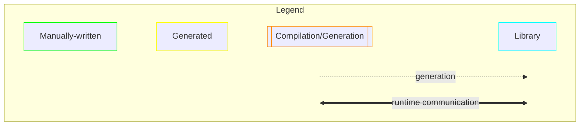

```mermaid
flowchart LR
    classDef Process stroke:#f80
    classDef Library stroke:#0ff
    classDef Authored stroke:#0f0
    classDef Generated stroke:#ff0
  classDef hidden display: none;

  subgraph Legend
    direction LR
    Authored["Manually-written"]:::Authored ~~~
    Generated["Generated"]:::Generated ~~~
    Process[[Compilation/Generation]]:::Process ~~~
    Library:::Library
    
    HIDDEN1:::hidden -. generation .-> HIDDEN2:::hidden
    HIDDEN3:::hidden <== runtime communication ==> HIDDEN4:::hidden
  end
```