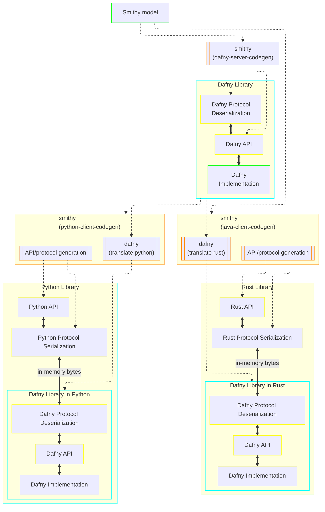

```mermaid
%%{init: {"flowchart": {"defaultRenderer": "elk"}} }%%
flowchart TB
    classDef Process stroke:#f80
    classDef Library stroke:#0ff
    classDef Authored stroke:#0f0
    classDef Generated stroke:#ff0

    SmithyModel["Smithy model"]:::Authored

    SmithySourceServerCodegen[["smithy
        (dafny-server-codegen)"]]:::Process

    subgraph SourceProject["Dafny Library"]
        SourceProtocolDeserialization["Dafny Protocol
        Deserialization"]:::Generated
        SourceAPI["Dafny API"]:::Generated
        SourceImpl["Dafny
        Implementation"]:::Authored
       
        SourceProtocolDeserialization <==> SourceAPI <==> SourceImpl
    end
    SourceProject:::Library

    SmithyModel -.-> SmithySourceServerCodegen -.-> SourceProtocolDeserialization & SourceAPI

    subgraph SmithyTargetClientCodegen["smithy 
                                    (java-client-codegen)"]
        SmithyTargetAPICodegen[["API/protocol generation"]]:::Process

        Compiler[["dafny
        (translate rust)"]]:::Process
    end
    SmithyTargetClientCodegen:::Process

    subgraph TargetProject["Rust Library"]
        TargetAPI["Rust API"]:::Generated
        TargetProtocolSerialization["Rust Protocol Serialization"]:::Generated

        subgraph SourceEmbeddedInTarget["Dafny Library in Rust"]
            SourceProtocolDeserializationInTarget["Dafny Protocol Deserialization"]:::Generated
            SourceAPIInTarget["Dafny API"]:::Generated
            SourceImplInTarget["Dafny Implementation"]:::Generated
        end
        SourceEmbeddedInTarget:::Library

        TargetAPI <==> TargetProtocolSerialization <== in-memory bytes ==> SourceProtocolDeserializationInTarget <==> SourceAPIInTarget <==> SourceImplInTarget
    end
    TargetProject:::Library

    SmithyModel -.-> SmithyTargetClientCodegen
    SmithyTargetAPICodegen -.-> TargetAPI & TargetProtocolSerialization
    SourceProject -.-> Compiler -.-> SourceEmbeddedInTarget

    subgraph SmithyTarget2ClientCodegen["smithy 
                                    (python-client-codegen)"]
        SmithyTarget2APICodegen[["API/protocol generation"]]:::Process

        Compiler2[["dafny
        (translate python)"]]:::Process
    end
    SmithyTarget2ClientCodegen:::Process

    subgraph Target2Project["Python Library"]
        Target2API["Python API"]:::Generated
        Target2ProtocolSerialization["Python Protocol Serialization"]:::Generated
            
        subgraph SourceEmbeddedInTarget2["Dafny Library in Python"]
            SourceProtocolDeserializationInTarget2["Dafny Protocol Deserialization"]:::Generated
            SourceAPIInTarget2["Dafny API"]:::Generated
            SourceImplInTarget2["Dafny Implementation"]:::Generated
        end
        SourceEmbeddedInTarget2:::Library

        Target2API <==> Target2ProtocolSerialization <== in-memory bytes ==> SourceProtocolDeserializationInTarget2 <==> SourceAPIInTarget2 <==> SourceImplInTarget2
    end
    Target2Project:::Library

    SmithyModel -.-> SmithyTarget2ClientCodegen
    SmithyTarget2APICodegen -.-> Target2API & Target2ProtocolSerialization
    SourceProject -.-> Compiler2 -.-> SourceEmbeddedInTarget2

```