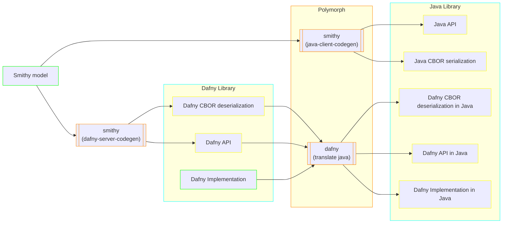

```mermaid
flowchart LR
    classDef Process stroke:#f80
    classDef Library stroke:#0ff
    classDef Authored stroke:#0f0
    classDef Generated stroke:#ff0

    Smithy["Smithy model"]:::Authored

    subgraph SourceProject["Dafny Library"]
        SourceDeserialization["Dafny CBOR deserialization"]:::Generated
        SourceAPI["Dafny API"]:::Generated
        SourceImpl["Dafny Implementation"]:::Authored
    end
    SourceProject:::Library

    subgraph Polymorph
        SmithyTargetClient[["smithy
        (java-client-codegen)"]]:::Process

        Compiler[["dafny
        (translate java)"]]:::Process
    end
    Polymorph:::Process

    SmithySourceClient[["smithy
    (dafny-server-codegen)"]]:::Process

    subgraph TargetProject["Java Library"]
        TargetAPI["Java API"]:::Generated
        TargetSerialization["Java CBOR serialization"]:::Generated
        SourceDeserializationInTarget["Dafny CBOR deserialization in Java"]:::Generated
        SourceAPIInTarget["Dafny API in Java"]:::Generated
        SourceImplInTarget["Dafny Implementation in Java"]:::Generated
    end
    TargetProject:::Library

    Smithy --> SmithyTargetClient --> TargetAPI & TargetSerialization
    Smithy --> SmithySourceClient --> SourceDeserialization & SourceAPI
    SourceDeserialization & SourceAPI & SourceImpl --> Compiler --> SourceDeserializationInTarget & SourceAPIInTarget & SourceImplInTarget

```