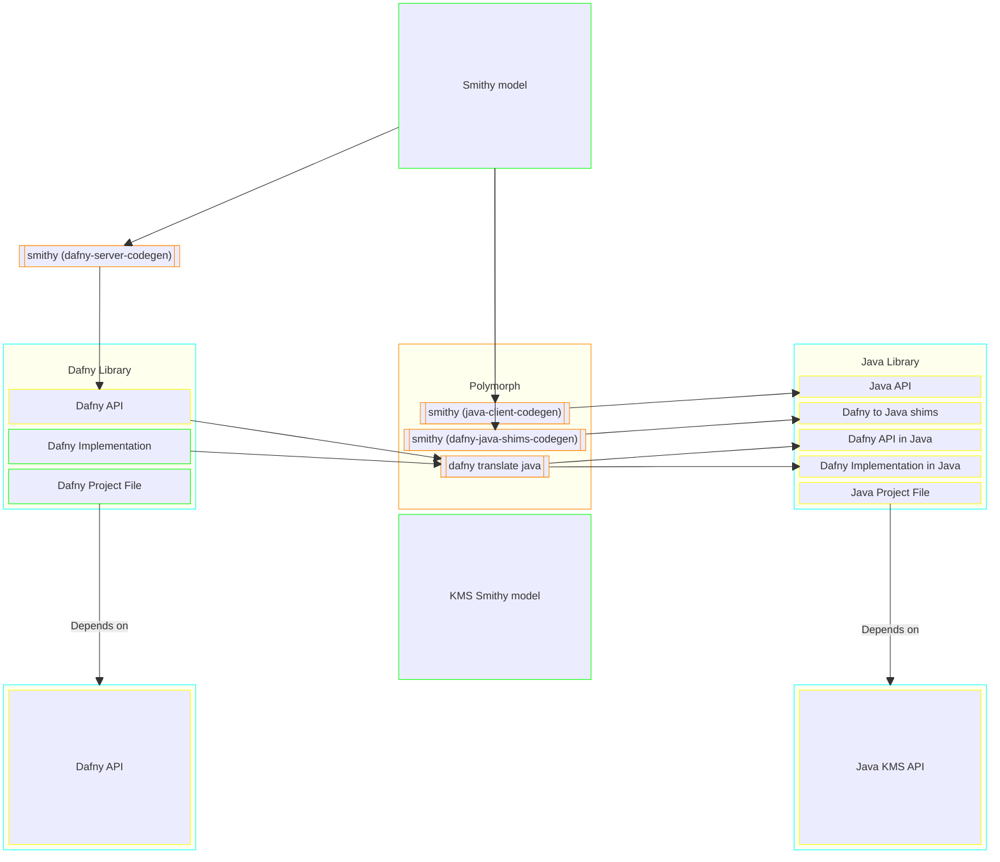

```mermaid
block-beta
    classDef Process stroke:#f80
    classDef Library stroke:#0ff
    classDef Authored stroke:#0f0
    classDef Generated stroke:#ff0

    columns 5

    space space SmithyModel["Smithy model"] space space
    class SmithyModel Authored

    SmithySourceClient[["smithy (dafny-server-codegen)"]] space space space space
    class SmithySourceClient Process

    block:SourceProject["Dafny Library\n\n\n\n\n\n\n\n"]
        columns 1
        space
        SourceAPI["Dafny API"]
        SourceImpl["Dafny Implementation"]
        SourceProjectFile["Dafny Project File"]
    end
    class SourceProject Library
    class SourceAPI Generated
    class SourceImpl Authored
    class SourceProjectFile Authored

    space

    block:Polymorph["Polymorph\n\n\n\n\n\n"]
        columns 1
        space
        space
        SmithyTargetClient[["smithy (java-client-codegen)"]]
        SmithyShims[["smithy (dafny-java-shims-codegen)"]]
        Compiler[["dafny translate java"]]
        space
    end
    class Polymorph Process
    class SmithyTargetClient Process
    class SmithyShims Process
    class Compiler Process
    class Generation Process
    
    space 

    block:TargetProject["Java Library\n\n\n\n\n\n\n\n\n"]
        columns 1
        space
        TargetAPI["Java API"]
        SourceToTargetShims["Dafny to Java shims"]
        SourceAPIInTarget["Dafny API in Java"]
        SourceImplInTarget["Dafny Implementation in Java"]
        TargetProjectFile["Java Project File"]
    end
    class TargetProject Library
    class TargetAPI Generated
    class SourceToTargetShims Generated
    class SourceAPIInTarget Generated
    class SourceImplInTarget Generated
    class TargetProjectFile Generated

    SmithyModel --> SmithySourceClient
    SmithySourceClient --> SourceAPI

    space space SmithyDependencyModel["KMS Smithy model"] space space
    class SmithyDependencyModel Authored

    block:SourceDependency["AWS KMS Dafny SDK"]
        SourceDependencyAPI["Dafny API"]
    end
    class SourceDependency Library
    class SourceDependencyAPI Generated

    space space space

    block:TargetDependency["Java AWS KMS SDK"]
        TargetDependencyAPI["Java KMS API"]
    end
    class TargetDependency Library
    class TargetDependencyAPI Generated

    SourceProjectFile -- "Depends on" --> SourceDependency
    TargetProjectFile -- "Depends on" --> TargetDependency

    SmithyModel --> SmithyTargetClient
    SmithyTargetClient --> TargetAPI
    SmithyModel --> SmithyShims
    SmithyShims --> SourceToTargetShims

    SourceAPI --> Compiler
    SourceImpl --> Compiler
    Compiler --> SourceAPIInTarget
    Compiler --> SourceImplInTarget

    

```