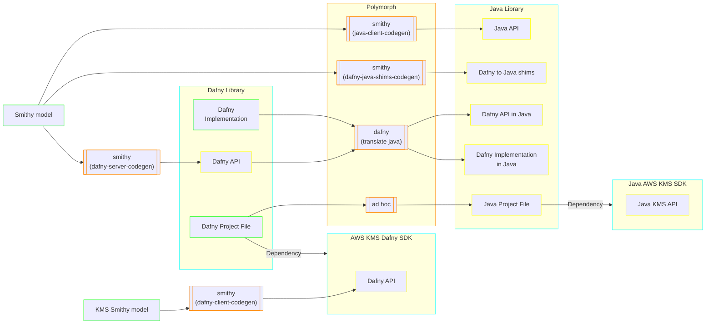

```mermaid
flowchart LR
    classDef Process stroke:#f80
    classDef Library stroke:#0ff
    classDef Authored stroke:#0f0
    classDef Generated stroke:#ff0

    SmithyModel["Smithy model"]:::Authored
    SmithyDependencyModel["KMS Smithy model"]:::Authored

    subgraph SourceProject["Dafny Library"]
        SourceImpl["Dafny
        Implementation"]:::Authored
        SourceAPI["Dafny API"]:::Generated
        SourceProjectFile["Dafny Project File"]:::Authored
    end
    SourceProject:::Library

    subgraph SourceDependency["AWS KMS Dafny SDK"]
        SourceDependencyAPI["Dafny API"]:::Generated
    end
    SourceDependency:::Library

    SmithySourceDependencyClient[["smithy
    (dafny-client-codegen)"]]:::Process

    subgraph Polymorph
        SmithyTargetClient[["smithy
        (java-client-codegen)"]]:::Process
        SmithyShims[["smithy
        (dafny-java-shims-codegen)"]]:::Process

        Compiler[["dafny
        (translate java)"]]:::Process

        Generation[["ad hoc"]]:::Process
    end
    Polymorph:::Process

    SmithySourceClient[["smithy
    (dafny-server-codegen)"]]:::Process

    SmithyDependencyModel --> SmithySourceDependencyClient --> SourceDependencyAPI

    subgraph TargetProject["Java Library"]
        TargetAPI["Java API"]:::Generated
        SourceToTargetShims["Dafny to Java shims"]:::Generated
        SourceAPIInTarget["Dafny API in Java"]:::Generated
        SourceImplInTarget["Dafny Implementation
        in Java"]:::Generated
        TargetProjectFile["Java Project File"]:::Generated
    end
    TargetProject:::Library

    subgraph TargetDependency["Java AWS KMS SDK"]
        TargetDependencyAPI["Java KMS API"]:::Generated
    end
    TargetDependency:::Library

    SmithyModel --> SmithyTargetClient --> TargetAPI
    SmithyModel --> SmithySourceClient --> SourceAPI
    SmithyModel --> SmithyShims --> SourceToTargetShims
    SourceAPI & SourceImpl --> Compiler --> SourceAPIInTarget & SourceImplInTarget
    SourceProjectFile --> Generation --> TargetProjectFile

    SourceProjectFile -- "Dependency" --> SourceDependency
    TargetProjectFile -- "Dependency" --> TargetDependency

    %% alignment links

    SmithyModel ~~~ SmithySourceDependencyClient

```