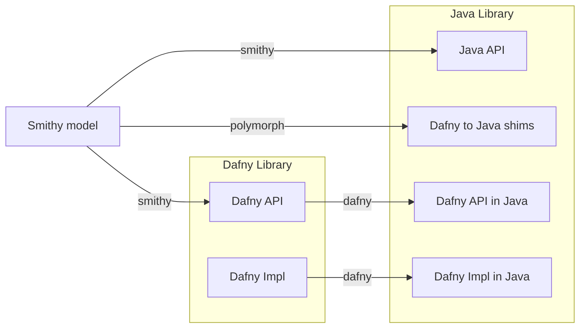

```mermaid
flowchart LR
    Smithy["Smithy model"]

    subgraph DafnyProject["Dafny Library"]
        DafnyAPI["Dafny API"]
        DafnyImpl["Dafny Impl"]
    end

    subgraph JavaProject["Java Library"]
        JavaAPI["Java API"]
        DafnyToJavaShims["Dafny to Java shims"]
        DafnyAPIInJava["Dafny API in Java"]
        DafnyImplInJava["Dafny Impl in Java"]
    end

    Smithy -- smithy ---> JavaAPI
    Smithy -- smithy --> DafnyAPI
    Smithy -- polymorph ---> DafnyToJavaShims
    DafnyAPI -- dafny --> DafnyAPIInJava
    DafnyImpl -- dafny --> DafnyImplInJava

```