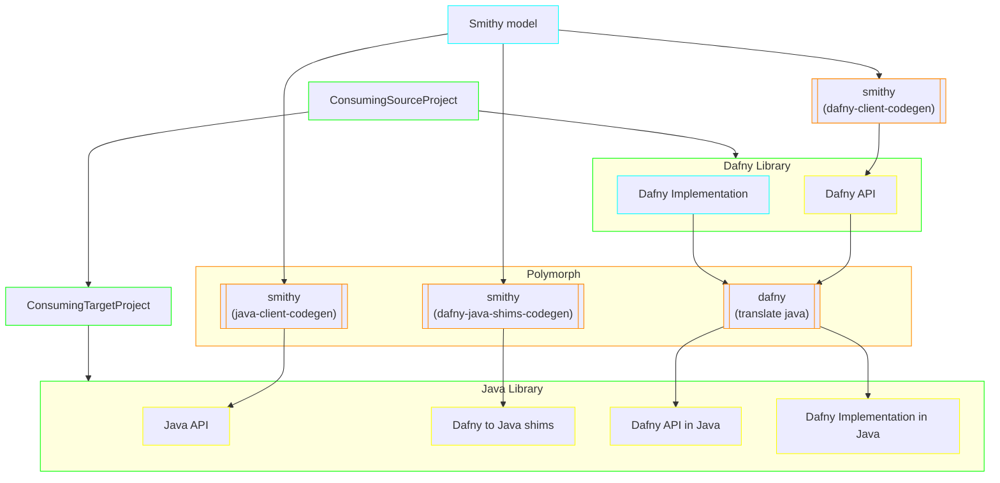

```mermaid
flowchart TD
    classDef Process stroke:#f80
    classDef Library stroke:#0f0
    classDef Authored stroke:#0ff
    classDef Generated stroke:#ff0

    Smithy["Smithy model"]:::Authored

    ConsumingSourceProject:::Library --> ConsumingTargetProject:::Library 

    ConsumingSourceProject:::Library --> SourceProject


    subgraph SourceProject["Dafny Library"]
        SourceAPI["Dafny API"]:::Generated
        SourceImpl["Dafny Implementation"]:::Authored
    end
    SourceProject:::Library

    subgraph Polymorph
        SmithyTargetClient[["smithy
        (java-client-codegen)"]]:::Process
        SmithyShims[["smithy
        (dafny-java-shims-codegen)"]]:::Process

        Compiler[["dafny
        (translate java)"]]:::Process
    end
    Polymorph:::Process

    SmithySourceClient[["smithy
    (dafny-client-codegen)"]]:::Process

    ConsumingTargetProject:::Library --> TargetProject

    subgraph TargetProject["Java Library"]
        TargetAPI["Java API"]:::Generated
        SourceToTargetShims["Dafny to Java shims"]:::Generated
        SourceAPIInTarget["Dafny API in Java"]:::Generated
        SourceImplInTarget["Dafny Implementation in Java"]:::Generated
    end
    TargetProject:::Library

    Smithy --> SmithyTargetClient --> TargetAPI
    Smithy --> SmithySourceClient --> SourceAPI
    Smithy --> SmithyShims --> SourceToTargetShims
    SourceAPI & SourceImpl --> Compiler --> SourceAPIInTarget & SourceImplInTarget

```