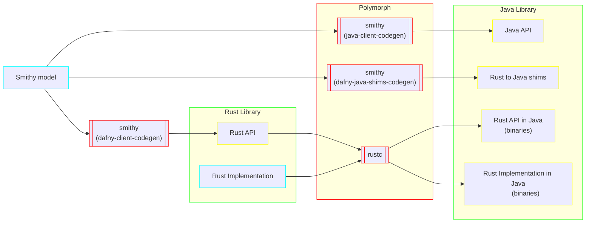

```mermaid
flowchart LR
    classDef Process stroke:#f00
    classDef Library stroke:#0f0
    classDef Authored stroke:#0ff
    classDef Generated stroke:#ff0

    Smithy["Smithy model"]:::Authored

    subgraph SourceProject["Rust Library"]
        SourceAPI["Rust API"]:::Generated
        SourceImpl["Rust Implementation"]:::Authored
    end
    SourceProject:::Library

    subgraph Polymorph
        SmithyTargetClient[["smithy
        (java-client-codegen)"]]:::Process
        SmithyShims[["smithy
        (dafny-java-shims-codegen)"]]:::Process

        Compiler[["rustc"]]:::Process
    end
    Polymorph:::Process

    SmithySourceClient[["smithy
    (dafny-client-codegen)"]]:::Process

    subgraph TargetProject["Java Library"]
        TargetAPI["Java API"]:::Generated
        SourceToTargetShims["Rust to Java shims"]:::Generated
        SourceAPIInTarget["Rust API in Java
        (binaries)"]:::Generated
        SourceImplInTarget["Rust Implementation in Java
        (binaries)"]:::Generated
    end
    TargetProject:::Library

    Smithy --> SmithyTargetClient --> TargetAPI
    Smithy --> SmithySourceClient --> SourceAPI
    Smithy --> SmithyShims --> SourceToTargetShims
    SourceAPI & SourceImpl --> Compiler --> SourceAPIInTarget & SourceImplInTarget

```