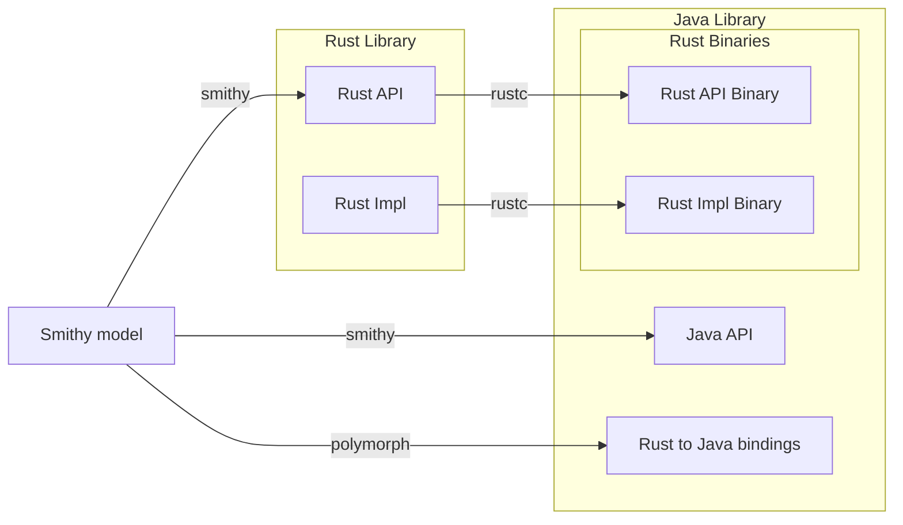

```mermaid
flowchart LR
    Smithy["Smithy model"]

    subgraph RustProject["Rust Library"]
        RustAPI["Rust API"]
        RustImpl["Rust Impl"]
    end

    subgraph JavaProject["Java Library"]
        JavaAPI["Java API"]
        RustToJavaShims["Rust to Java bindings"]

        subgraph RustBinaries["Rust Binaries"]
            RustAPIInJava["Rust API Binary"]
            RustImplInJava["Rust Impl Binary"]
        end
    end

    Smithy -- smithy ---> JavaAPI
    Smithy -- smithy --> RustAPI
    Smithy -- polymorph ---> RustToJavaShims
    RustAPI -- rustc --> RustAPIInJava
    RustImpl -- rustc --> RustImplInJava

```