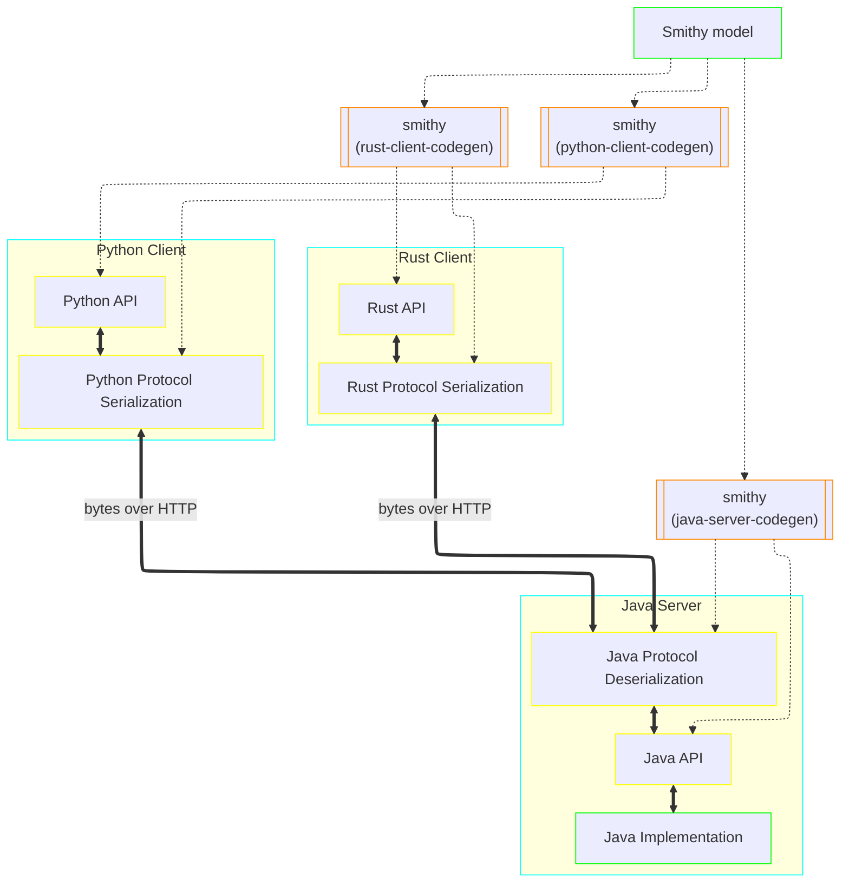

```mermaid
%%{init: {"flowchart": {"defaultRenderer": "elk"}} }%%
flowchart TD
    classDef Process stroke:#f80
    classDef Library stroke:#0ff
    classDef Authored stroke:#0f0
    classDef Generated stroke:#ff0
    classDef hidden display: none;

    SmithyModel["Smithy model"]:::Authored

    SmithySourceServerCodegen[["smithy
    (java-server-codegen)"]]:::Process

    SmithyModel -.-> SmithySourceServerCodegen -.-> SourceAPI & SourceProtocolDeserialization

    subgraph SourceProject["Java Server"]
        SourceProtocolDeserialization["Java Protocol Deserialization"]:::Generated
        SourceAPI["Java API"]:::Generated
        SourceImpl["Java Implementation"]:::Authored

        SourceProtocolDeserialization <==> 
        SourceAPI <==> 
        SourceImpl
    end
    SourceProject:::Library

    SmithyTargetClientCodegen[["smithy 
                                    (rust-client-codegen)"]]:::Process

    subgraph TargetProject["Rust Client"]
        TargetAPI["Rust API"]:::Generated
        TargetProtocolSerialization["Rust Protocol Serialization"]:::Generated

        TargetAPI <==> TargetProtocolSerialization
    end
    TargetProject:::Library

    SmithyModel -.-> SmithyTargetClientCodegen -.-> TargetAPI & TargetProtocolSerialization


    SmithyTarget2ClientCodegen[["smithy 
                                    (python-client-codegen)"]]:::Process

    subgraph Target2Project["Python Client"]
        Target2API["Python API"]:::Generated
        Target2ProtocolSerialization["Python Protocol Serialization"]:::Generated

        Target2API <==> Target2ProtocolSerialization
    end
    Target2Project:::Library

    SmithyModel -.-> SmithyTarget2ClientCodegen -.-> Target2API & Target2ProtocolSerialization

    TargetProtocolSerialization & Target2ProtocolSerialization <== bytes over HTTP ==> 
    SourceProtocolDeserialization

```