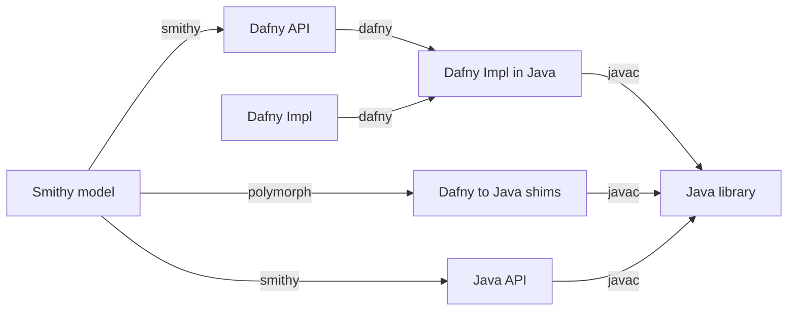

```mermaid
flowchart LR
    JavaAPI["Java API"]
    Smithy["Smithy model"]
    DafnyAPI["Dafny API"]
    DafnyImpl["Dafny Impl"]
    DafnyImplInJava["Dafny Impl in Java"]
    DafnyToJavaShims["Dafny to Java shims"]
    JavaLibrary["Java library"]

    Smithy -- smithy ---> JavaAPI
    Smithy -- smithy --> DafnyAPI
    Smithy -- polymorph ---> DafnyToJavaShims
    DafnyAPI -- dafny --> DafnyImplInJava
    DafnyImpl -- dafny --> DafnyImplInJava
    DafnyImplInJava -- javac --> JavaLibrary
    DafnyToJavaShims -- javac --> JavaLibrary
    JavaAPI -- javac --> JavaLibrary

```